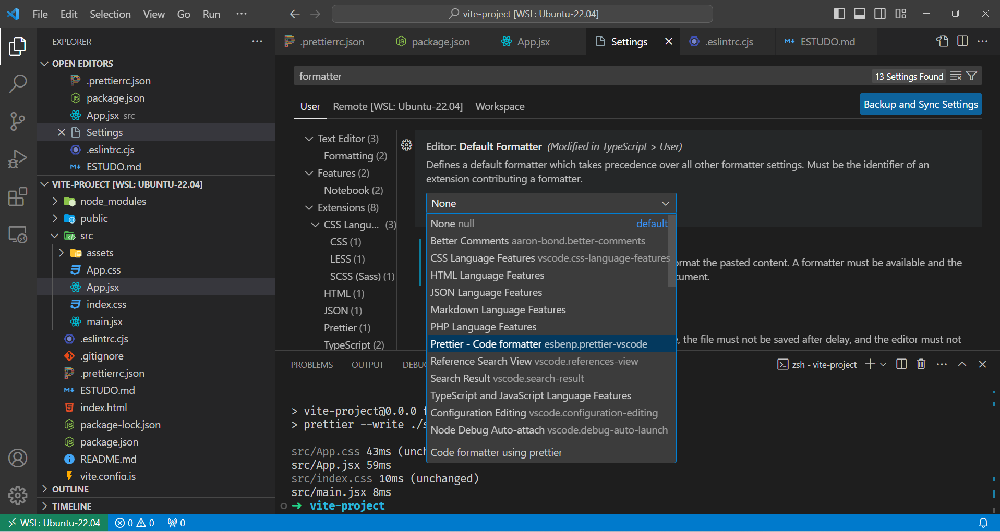
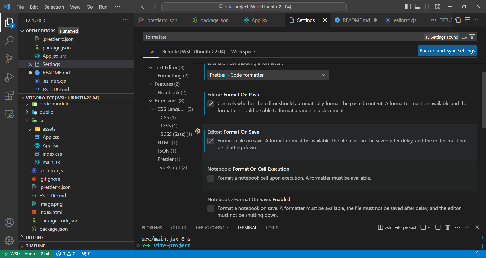

# React + Vite in terminal Ubuntu WSL

This template provides a minimal setup to get React working in Vite with HMR and some ESLint rules.

Currently, two official plugins are available:

- [@vitejs/plugin-react](https://github.com/vitejs/vite-plugin-react/blob/main/packages/plugin-react/README.md) uses [Babel](https://babeljs.io/) for Fast Refresh
- [@vitejs/plugin-react-swc](https://github.com/vitejs/vite-plugin-react-swc) uses [SWC](https://swc.rs/) for Fast Refresh

## Vite Documentation

https://vitejs.dev/guide/





## Terminal Step by Step Vite and React

```sh
➜  vite-project npm install --save-dev --save-exact prettier

added 1 package, and audited 272 packages in 4s

98 packages are looking for funding
  run `npm fund` for details

found 0 vulnerabilities
```

```sh
➜  vite-project npm fund
vite-project@0.0.0
├─┬ https://opencollective.com/eslint
│ │ └── eslint@8.56.0, @eslint/eslintrc@2.1.4, eslint-scope@7.2.2, eslint-visitor-keys@3.4.3, espree@9.6.1
│ ├── https://github.com/sponsors/nzakas
│ │   └── @humanwhocodes/module-importer@1.0.1
│ ├── https://github.com/sponsors/epoberezkin
│ │   └── ajv@6.12.6
│ ├─┬ https://github.com/chalk/chalk?sponsor=1
│ │ │ └── chalk@4.1.2
│ │ └── https://github.com/chalk/ansi-styles?sponsor=1
│ │     └── ansi-styles@4.3.0
│ ├── https://github.com/sponsors/feross
│ │   └── run-parallel@1.2.0, queue-microtask@1.2.3
│ └── https://github.com/sponsors/isaacs
│     └── rimraf@3.0.2, glob@7.2.3
├── https://github.com/prettier/prettier?sponsor=1
│   └── prettier@3.1.1
├─┬ https://github.com/vitejs/vite?sponsor=1
│ │ └── vite@5.0.10
│ └─┬ https://opencollective.com/postcss/
│   │ └── postcss@8.4.33
│   └── https://github.com/sponsors/ai
│       └── nanoid@3.3.7
├─┬ https://opencollective.com/babel
│ │ └── @babel/core@7.23.7
│ └── https://opencollective.com/browserslist
│     └── browserslist@4.22.2, caniuse-lite@1.0.30001574, update-browserslist-db@1.0.13
└── https://github.com/sponsors/ljharb
    └── array-includes@3.1.7, call-bind@1.0.5, function-bind@1.1.2, gopd@1.0.1, has-property-descriptors@1.0.1, define-properties@1.2.1, es-abstract@1.22.3, array-buffer-byte-length@1.0.0, arraybuffer.prototype.slice@1.0.2, available-typed-arrays@1.0.5, es-to-primitive@1.2.1, is-date-object@1.0.5, is-symbol@1.0.4, function.prototype.name@1.1.6, functions-have-names@1.2.3, get-symbol-description@1.0.0, globalthis@1.0.3, has-proto@1.0.1, has-symbols@1.0.3, is-array-buffer@3.0.2, is-callable@1.2.7, is-negative-zero@2.0.2, is-regex@1.1.4, is-shared-array-buffer@1.0.2, is-typed-array@1.1.12, is-weakref@1.0.2, object-inspect@1.13.1, object.assign@4.1.5, regexp.prototype.flags@1.5.1, safe-array-concat@1.0.1, safe-regex-test@1.0.0, string.prototype.trim@1.2.8, string.prototype.trimend@1.0.7, string.prototype.trimstart@1.0.7, typed-array-byte-length@1.0.0, typed-array-byte-offset@1.0.0, typed-array-length@1.0.4, unbox-primitive@1.0.2, has-bigints@1.0.2, which-boxed-primitive@1.0.2, is-bigint@1.0.4, is-boolean-object@1.1.2, is-number-object@1.0.7, which-typed-array@1.1.13, has-tostringtag@1.0.0, side-channel@1.0.4, get-intrinsic@1.2.2, is-string@1.0.7, array.prototype.flatmap@1.3.2, object.fromentries@2.0.7, object.hasown@1.1.3, object.values@1.1.7, resolve@2.0.0-next.5, is-core-module@2.13.1, supports-preserve-symlinks-flag@1.0.0, string.prototype.matchall@4.0.10, reflect.getprototypeof@1.0.4, which-builtin-type@1.1.3, is-async-function@2.0.0, is-finalizationregistry@1.0.2, is-generator-function@1.0.10, which-collection@1.0.1, is-map@2.0.2, is-set@2.0.2, is-weakmap@2.0.1, is-weakset@2.0.2, array.prototype.flat@1.3.2
```

```sh
➜  vite-project npm install --save-dev eslint-config-prettier

added 1 package, and audited 273 packages in 1s

98 packages are looking for funding
  run `npm fund` for details

found 0 vulnerabilities
➜  vite-project npx eslint-config-prettier src/main.jsx
No rules that are unnecessary or conflict with Prettier were found.
```

```sh
➜  vite-project npm run format

> vite-project@0.0.0 format
> prettier --write ./src

src/App.css 43ms (unchanged)
src/App.jsx 59ms
src/index.css 10ms (unchanged)
src/main.jsx 8ms
```
